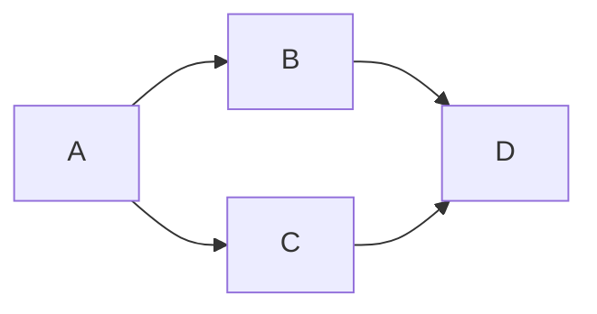

# notableMarkdownGuide
an everchanging list of all features on Notable app's markdown


# all markdown syntax supported by notable
## source: <https://cheatsheet.md/notable.pdf>
**note that notable app only reads markdown files at root level not nested, even has graph to show links between documents, search term doesnt bring you to the term (doesnt work well on final document), but we can jump between headers
** search works well inside split mode with status bar
** in logging we will just log each new header for group of comments so easy to jump to
# header
## subheader
### subsub
<a name="abcd">Click to jump section #abcd</a>
_bold_
*italic*
subscript~example~
superscript^example^
- unordered list
    - nested unordered list after tab


1. ordered list
1. second item
    1. nested ordered lis

+ [ ] checked task with space in bracket
+ [x] checked task

[Link](logging.md) 
Links to local markdown file

<https:www.google.com> autolinking without using []()


> quotation
>> nested quotation

this is 
```
fenced code
```

this is `unfenced code`

table Below
|a|b|
|-|-|
|1|2|

separator Below
---

emoji
:smile:

ascii math below
```asciimath
e=mc^2
```
click below will activate search and tag filter on notable itself
[tag basics](@tag/basic)
[linking](@search/linking)

escaping char when write: 
    a \\\_shouldBeItalic\\\_
we get:
     a \_shouldBeItalic\_

HTML
<details>
      <summary>Put title here, otherwise defaults to "details</summary>

hi
</details>


kbd does nothing
<kbd>Ctrl+F5</kbd>
<details open>
    <markdown>
    - allow markdown inside html
    </markdown>
</details>


# Below doesnt work
[Link][1]
[1]:logging.md "Logg"
 Links to local markdown file
 Links to local markdown file

```
    # header

    _bold_
    *italic*
    subscript~example~
    superscript^example^
    - unordered list
        - nested unordered list after tab


    1. ordered list
    1. second item
        1. nested ordered lis

    + [ ] checked task with space in bracket
    + [x] checked task

    [Link](logging.md) 
    Links to local markdown file

    <https:www.google.com> autolinking without using []()

    

    > quotation
    >> nested quotation

    this is 
    ```
    fenced code
    ```

    this is `unfenced code`

    tbale Below
    |a|b|
    |-|-|
    |1|2|

    separator Below
    ---

    emoji
    :smile:

    ascii math below
    ```asciimath
    e=mc^2
    ```
    click below will activate search and tag filter on notable itself
    [tag basics](@tag/basic)
    [linking](@search/linking)

    escaping char when write: 
        a \\\_shouldBeItalic\\\_
    we get:
        a \_shouldBeItalic\_

    HTML
    <details>
          <summary>Put title here, otherwise defaults to "details</summary>

    hi
    </details>

    ```mermaid
    graph LR;
        A-->B;
        A-->C;
        B-->D;
        C-->D;
    ```


```


[link text](#abcd)
