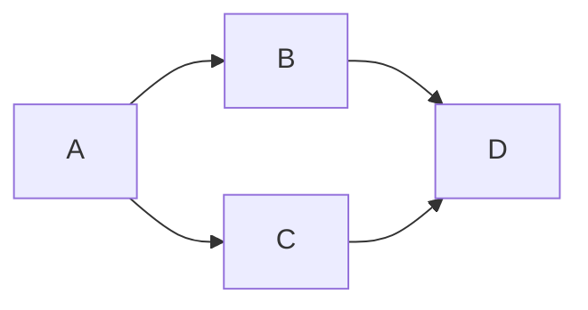

# notableMarkdownGuide
an everchanging list of all features on Notable app's markdown


# all markdown syntax supported by notable
## source: <https://cheatsheet.md/notable.pdf>
**note that notable app only reads markdown files at root level not nested, even has graph to show links between documents, search term doesnt bring you to the term (doesnt work well on final document), but we can jump between headers
** search works well inside split mode with status bar
** in logging we will just log each new header for group of comments so easy to jump to
# header
## subheader
### subsub
<a name="abcd">Click to jump section #abcd</a>
_bold_
*italic*
subscript~example~
superscript^example^
- unordered list
    - nested unordered list after tab


1. ordered list
1. second item
    1. nested ordered lis

+ [ ] checked task with space in bracket
+ [x] checked task

[Link](logging.md) 
Links to local markdown file

<https:www.google.com> autolinking without using []()


FEATURES in html
<markdown># htmltagtest from pug for scientific papers</markdown>
<script>document.write("script doesnt work in Notable");</script>
<details>test</details>
<nav>navigation with a href nested<br/><a href="abc.md">abc |</a><a href="abc.md"> dwa |</a><a href="abc.md"> wa</a></nav>
<q>q is quoted text wheares blockquote takes up whole paragraph </q><strong>strong text is bolded text</strong>
<blockquote>blockquote:this is a test </blockquote>
<button>button test (doesnt look very nice in notable)</button>
<canvas>canvas test (doestn work in notable)
  <div>some content inside canvas</div>
</canvas>
<center>center text</center>
<cite>cite text (text looks italic inside notable)</cite><br/><code>code text</code><br/>
<command>command text (text has no difference inside notable)</command>
<datalist>(doesnt work)</datalist><br/>
<del>deleted word (or crossed out word)</del><ins>inserted word (underline inserted word)</ins>
<mark>mark word  (color highlight inserted word)</mark>
<s>s for strikethrough contrast with underline , italic, bold</s><br/><br/>
<fieldset>(doesnt work well)
  <legend>gender</legend>
  <input type="radio" name="gender"/>
  <label for="male">male</label>
</fieldset>
<hr/>
<figure>
  <figcaption>figcaption example (just below the image wrapped in figure tag below image tag)</figcaption>
</figure>
<iframe>try embed youtube??</iframe><br/><map name="define">(doesnt work in notable)
  <h1>reveal map tag </h1></map>
<div>meter works really nice</div>
<meter value="80" min="0" max="100"></meter><br/>
<meter value="60" min="0" max="100"></meter><br/>
<div>progress is square meter is rounded</div>
<progress value="60" min="0" max="100"></progress><br/>
<table>
  <thead>
    <tr>
      <th>name</th>
      <th>address</th>
    </tr>
  </thead>
  <tfoot>
    <tr>
      <td colspan="2">colspan two</td>
    </tr>
  </tfoot>
  <tbody>
    <tr>
      <td>dwa</td>
      <td>dwa</td>
    </tr>
  </tbody>
</table>

> quotation
>> nested quotation

this is 
```
fenced code
```

this is `unfenced code`

table Below
|a|b|
|-|-|
|1|2|

separator Below
---

emoji
:smile:

ascii math below
```asciimath
e=mc^2
```
click below will activate search and tag filter on notable itself
[tag basics](@tag/basic)
[linking](@search/linking)

escaping char when write: 
    a \\\_shouldBeItalic\\\_
we get:
     a \_shouldBeItalic\_

HTML
<details>
      <summary>Put title here, otherwise defaults to "details</summary>

hi
</details>


kbd does nothing
<kbd>Ctrl+F5</kbd>
<details open>
    <markdown>
    - allow markdown inside html
    </markdown>
</details>


# Below doesnt work
[Link][1]
[1]:logging.md "Logg"
 Links to local markdown file
 Links to local markdown file

```
    # header

    _bold_
    *italic*
    subscript~example~
    superscript^example^
    - unordered list
        - nested unordered list after tab


    1. ordered list
    1. second item
        1. nested ordered lis

    + [ ] checked task with space in bracket
    + [x] checked task

    [Link](logging.md) 
    Links to local markdown file

    <https:www.google.com> autolinking without using []()

    

    > quotation
    >> nested quotation

    this is 
    ```
    fenced code
    ```

    this is `unfenced code`

    tbale Below
    |a|b|
    |-|-|
    |1|2|

    separator Below
    ---

    emoji
    :smile:

    ascii math below
    ```asciimath
    e=mc^2
    ```
    click below will activate search and tag filter on notable itself
    [tag basics](@tag/basic)
    [linking](@search/linking)

    escaping char when write: 
        a \\\_shouldBeItalic\\\_
    we get:
        a \_shouldBeItalic\_

    HTML
    <details>
          <summary>Put title here, otherwise defaults to "details</summary>

    hi
    </details>

    ```mermaid
    graph LR;
        A-->B;
        A-->C;
        B-->D;
        C-->D;
    ```


```


[link text](#abcd)


<markdown># htmltagtest from pug for scientific papers</markdown>
<script>document.write("script doesnt work in Notable");</script>
<details>test</details>
<nav>navigation with a href nested<br/><a href="abc.md">abc |</a><a href="abc.md"> dwa |</a><a href="abc.md"> wa</a></nav>
<q>q is quoted text wheares blockquote takes up whole paragraph </q><strong>strong text is bolded text</strong>
<blockquote>blockquote:this is a test </blockquote>
<button>button test (doesnt look very nice in notable)</button>
<canvas>canvas test (doestn work in notable)
  <div>some content inside canvas</div>
</canvas>
<center>center text</center>
<cite>cite text (text looks italic inside notable)</cite><br/><code>code text</code><br/>
<command>command text (text has no difference inside notable)</command>
<datalist>(doesnt work)</datalist><br/>
<del>deleted word (or crossed out word)</del><ins>inserted word (underline inserted word)</ins>
<mark>mark word  (color highlight inserted word)</mark>
<s>s for strikethrough contrast with underline , italic, bold</s><br/><br/>
<fieldset>(doesnt work well)
  <legend>gender</legend>
  <input type="radio" name="gender"/>
  <label for="male">male</label>
</fieldset>
<hr/>
<figure>
  <figcaption>figcaption example (just below the image wrapped in figure tag below image tag)</figcaption>
</figure>
<iframe>try embed youtube??</iframe><br/><map name="define">(doesnt work in notable)
  <h1>reveal map tag </h1></map>
<div>meter works really nice</div>
<meter value="80" min="0" max="100"></meter><br/>
<meter value="60" min="0" max="100"></meter><br/>
<div>progress is square meter is rounded</div>
<progress value="60" min="0" max="100"></progress><br/>
<table>
  <thead>
    <tr>
      <th>name</th>
      <th>address</th>
    </tr>
  </thead>
  <tfoot>
    <tr>
      <td colspan="2">colspan two</td>
    </tr>
  </tfoot>
  <tbody>
    <tr>
      <td>dwa</td>
      <td>dwa</td>
    </tr>
  </tbody>
</table>

```html
<markdown># htmltagtest from pug for scientific papers</markdown>
<script>document.write("script doesnt work in Notable");</script>
<details>test</details>
<nav>navigation with a href nested<br/><a href="abc.md">abc |</a><a href="abc.md"> dwa |</a><a href="abc.md"> wa</a></nav>
<q>q is quoted text wheares blockquote takes up whole paragraph </q><strong>strong text is bolded text</strong>
<blockquote>blockquote:this is a test </blockquote>
<button>button test (doesnt look very nice in notable)</button>
<canvas>canvas test (doestn work in notable)
  <div>some content inside canvas</div>
</canvas>
<center>center text</center>
<cite>cite text (text looks italic inside notable)</cite><br/><code>code text</code><br/>
<command>command text (text has no difference inside notable)</command>
<datalist>(doesnt work)</datalist><br/>
<del>deleted word (or crossed out word)</del><ins>inserted word (underline inserted word)</ins>
<mark>mark word  (color highlight inserted word)</mark>
<s>s for strikethrough contrast with underline , italic, bold</s><br/><br/>
<fieldset>(doesnt work well)
  <legend>gender</legend>
  <input type="radio" name="gender"/>
  <label for="male">male</label>
</fieldset>
<hr/>
<figure>
  <figcaption>figcaption example (just below the image wrapped in figure tag below image tag)</figcaption>
</figure>
<iframe>try embed youtube??</iframe><br/><map name="define">(doesnt work in notable)
  <h1>reveal map tag </h1></map>
<div>meter works really nice</div>
<meter value="80" min="0" max="100"></meter><br/>
<meter value="60" min="0" max="100"></meter><br/>
<div>progress is square meter is rounded</div>
<progress value="60" min="0" max="100"></progress><br/>
<table>
  <thead>
    <tr>
      <th>name</th>
      <th>address</th>
    </tr>
  </thead>
  <tfoot>
    <tr>
      <td colspan="2">colspan two</td>
    </tr>
  </tfoot>
  <tbody>
    <tr>
      <td>dwa</td>
      <td>dwa</td>
    </tr>
  </tbody>
</table>
```
